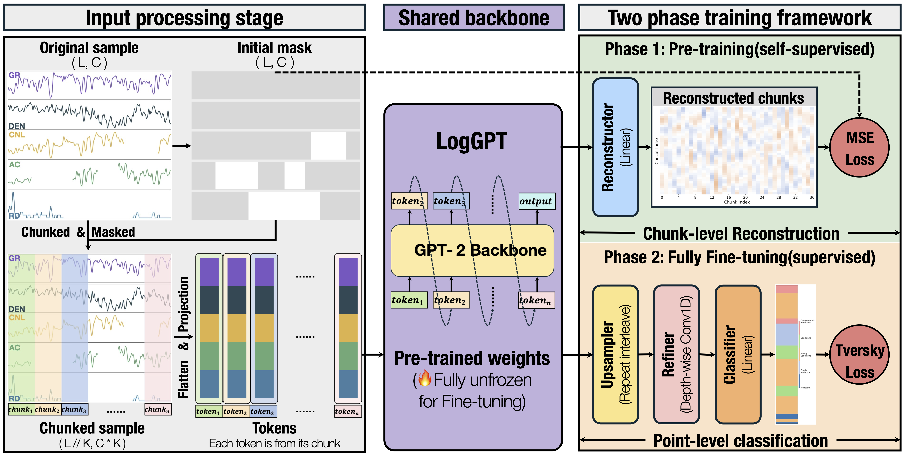

<p align="center" width="100%">

</p>

<div align="center">
    <strong>
    LogGPT: Chunk-Based Autoregressive Self-Supervised Pretraining  
    for Lithology Identification From Well Logs
    </strong>
    </br>
    <a href='https://github.com/yourname' target='_blank'>Chuanli Dai,<sup>1,2,3</sup></a>&emsp;
    <a href='#'>Xinming Wu,<sup>1,2,3</sup></a>&emsp;
    <a href='#'>Xiaoming Sun,<sup>1,2,3</sup></a>&emsp;
    <a href='#'>Qing Yu,<sup>4</sup></a>&emsp;    
</div>

<div align="center">
    <sup>1</sup> State Key Laboratory of Precision Geodesy, School of Earth and Space Sciences, University of Science and Technology of China, Hefei 230026, China. &emsp;
    <sup>2</sup> Mengcheng National Geophysical Observatory, University of Science and Technology of China, Mengcheng, 233500, China. &emsp;
    <sup>3</sup> Anhui Provincial Key Laboratory of Subsurface Exploration and Earthquake Hazard Risk Prevention, Hefei, 230031, China. &emsp;
    <sup>4</sup> Institute of Advanced Technology, University of Science and Technology of China, Hefei, China 230026;
</div>

---

# 🌟 LogGPT

Lithology identification is a fundamental task in hydrocarbon exploration and reservoir characterization. However, it remains challenging due to:

- Complex nonlinear responses  
- Limited labeled data with class imbalance  
- Point-wise modeling limitations  
- Widespread missing data  

To address these challenges, we propose **LogGPT**, a chunk-based autoregressive self-supervised framework for lithology identification.

---

## 🔥 Key Ideas

- **Chunk-based modeling**  
  Instead of point-wise prediction, logs are partitioned into chunks to capture stratigraphic context.

- **Autoregressive pretraining (GPT-style)**  
  Enables learning deeper geological patterns rather than local interpolation.

- **Self-supervised learning**  
  Leverages large-scale unlabeled well logs.

- **Missing-aware masking**  
  Handles incomplete logs naturally.

- **Focal Tversky loss**  
  Mitigates severe class imbalance.

---

## ⚙️ Installation

```bash
conda create -n loggpt python=3.10
conda activate loggpt

pip install -r requirements.txt
```

---

## 🚀 Usage

### 🔹 Training

Run the following command to train LogGPT:

```bash
python train.py
```

---

### 🔹 Evaluation

Evaluate the trained model:

```bash
python test.py
```

---

### 🔹 Optional Arguments

You can customize training and evaluation with additional arguments:

```bash
python train.py --batch_size 32 --lr 1e-4 --epochs 100
```

```bash
python test.py --checkpoint path/to/model.pth
```

---

### 🔹 Notes

* Make sure the dataset is correctly placed in the `data/` directory
* Modify configuration parameters in `config.py` if needed
* GPU is recommended for training
